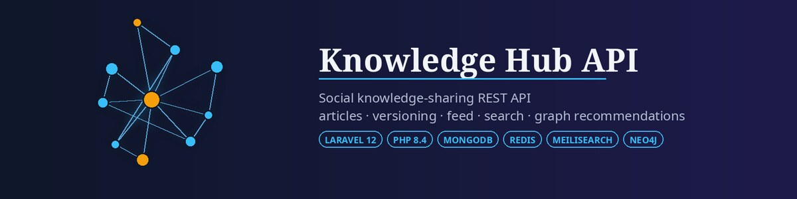

# Hi, I'm Gabriel Silva 👋

**Full-Stack Developer — PHP · Laravel · Angular · TypeScript · Node.js**

Remote from Brazil (UTC-3) · Open to remote opportunities

**English** · [Português (Brasil)](README.pt-BR.md)

## About me

Full-stack developer with 2.5+ years building production web applications — REST APIs in Laravel and Node.js, Angular front ends, relational and NoSQL databases, Docker and CI/CD. I care about readable code, automated tests and shipping things people actually use.

- 💼 **Full-Stack Developer (Mid-level) at [AGTech Soluções](https://grupoagtech.com)** — remote, since March 2024. Laravel + Angular + MySQL products (HidroMeter, Topes, PremoPlan) used by clients in Brazil, Singapore and Panama. I designed and own HidroMeter's automatic-trigger module end to end.
- 🚀 **Founder of [Kodem ABNT](https://kodem.com.br)** — a SaaS that formats Brazilian academic papers to the ABNT standard: reference auto-fill from DOI/ISBN/URL, a CrossRef-backed reference checker and Word (`.docx`) export. Angular 20 + Laravel, 500+ active users since its June 2026 launch.
- 🌍 **Open-source contributor** — merged fixes in Laravel, Symfony, Swashbuckle.AspNetCore and Super Productivity ([see below](#open-source-contributions)).
- 🎓 B.Sc. in Computer Science at UNIP (expected December 2027).

## Tech stack

| Area | Tools |
|---|---|
| **Back end** |      |
| **Front end** |      |
| **Data** |       |
| **Testing** |     |
| **DevOps** |       |

## Featured projects

<table>
<tr>
<td width="50%" valign="top">

**[Knowledge Hub API](https://github.com/GabeSilvaDev/knowledge-hub)** 
REST API for a social knowledge-sharing platform: versioned articles, feed, full-text search, graph-based recommendations and real-time rankings. 
Laravel 12 · MongoDB · Redis · Meilisearch · Neo4j · 1,192 Pest tests · PHPStan level 10

</td>
<td width="50%" valign="top">

**[Subterrâneo](https://github.com/GabeSilvaDev/Subterraneo)** · [▶ Play in the browser](https://gabesilvadev.github.io/Subterraneo/) 
2D top-down cave adventure: nine levels, melee combat, minecart traversal and a two-phase final boss. Windows, Linux and Web builds. 
Godot 4.3 · GDScript

</td>
</tr>
<tr>
<td width="50%" valign="top">

**[Mage: The Ascension — Character Sheet](https://github.com/GabeSilvaDev/mago-ficha)** · [▶ Open the app](https://gabesilvadev.github.io/mago-ficha/) 
Offline-first character sheet with a rule-enforcing creation wizard, official PDF export and an optional live online table. 
Flutter · Dart · Firebase · Android + PWA

</td>
<td width="50%" valign="top">

**[Fichário do Outro Lado](https://github.com/GabeSilvaDev/fichario-do-outro-lado)** · [▶ Open the app](https://gabesilvadev.github.io/fichario-do-outro-lado/) 
Character sheet and real-time online table for the *Ordem Paranormal* RPG: sheets and rolls mirrored to the GM in ~2 s, 150-entry bestiary. 
Flutter · Dart · Firestore · Android + PWA

</td>
</tr>
</table>

**Back-end work in progress**

| Project | What it is | Stack |
|---|---|---|
| [Real-Time Messaging Platform](https://github.com/GabeSilvaDev/realtime-messaging-platform) | Chat backend — JWT auth with refresh-token rotation and sessions, profiles, avatar upload (local or S3); WebSocket messaging next. 1,316 Jest tests, CI on every push. | Node.js · TypeScript · Express 5 · PostgreSQL · Redis · MongoDB · Elasticsearch |
| [Fintech Bank Platform](https://github.com/GabeSilvaDev/fintech-bank-platform) | Event-driven banking backend — an API gateway publishes commands to Kafka; account and transaction services settle deposits, withdrawals and transfers as sagas with compensation. 100% test coverage enforced in CI. | Go · Kafka (KRaft) · Cassandra · Redis |

## Open-source contributions

| Project | Pull request | Status |
|---|---|:---:|
| [laravel/framework](https://github.com/laravel/framework) | [#61567](https://github.com/laravel/framework/pull/61567) — Fix `appendToPriorityList()` when the referenced middleware is the first item | ✅ Merged |
| [symfony/symfony](https://github.com/symfony/symfony) | [#66023](https://github.com/symfony/symfony/pull/66023) — [HttpFoundation] Fix `IpUtils::anonymize()` for non-canonical IPv4-mapped addresses | ✅ Merged |
| [Swashbuckle.AspNetCore](https://github.com/domaindrivendev/Swashbuckle.AspNetCore) | [#4152](https://github.com/domaindrivendev/Swashbuckle.AspNetCore/pull/4152) — Strip query string from relative document URLs in Swagger UI | ✅ Merged |
| [Super Productivity](https://github.com/super-productivity/super-productivity) | [#10059](https://github.com/super-productivity/super-productivity/pull/10059) — Make Tab accept a tag suggestion and Enter use the typed text | ✅ Merged |
| [typescript-eslint](https://github.com/typescript-eslint/typescript-eslint) | [#12888](https://github.com/typescript-eslint/typescript-eslint/pull/12888) — Declare inferred type parameters in the conditional type whose `extends` clause contains them | 🔍 In review |
| [Ghostfolio](https://github.com/ghostfolio/ghostfolio) | [#7937](https://github.com/ghostfolio/ghostfolio/pull/7937) — Fix alignment of the average price in the holding detail chart | 🔍 In review |

## Contact

The fastest way to reach me is [LinkedIn](https://www.linkedin.com/in/gabesilvadev/) or [email](mailto:gabrielsilvadev.comercial@gmail.com).
